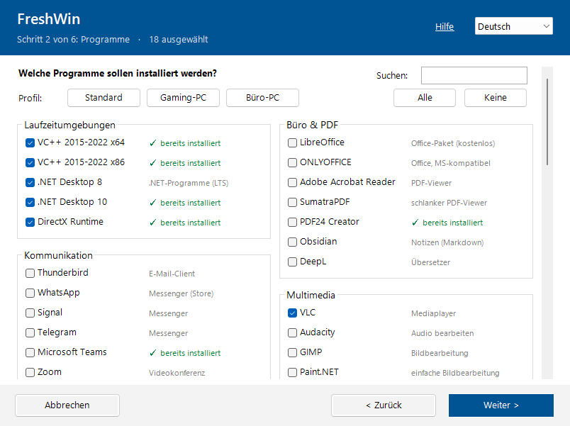
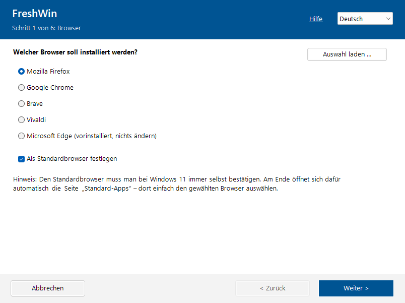
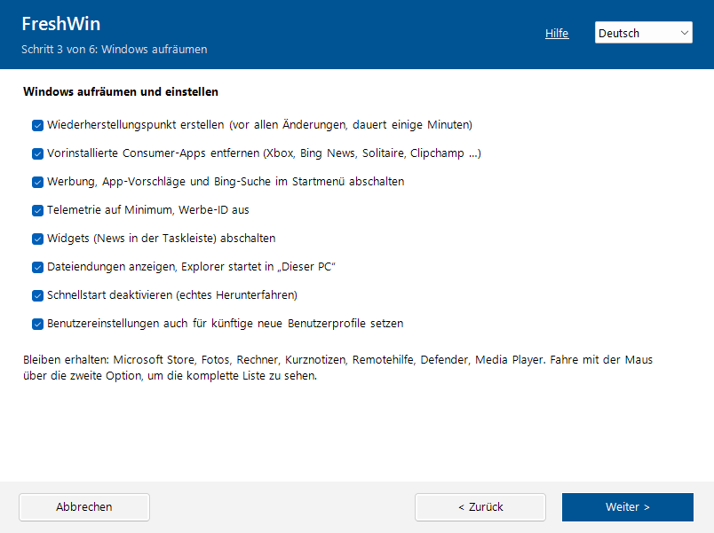
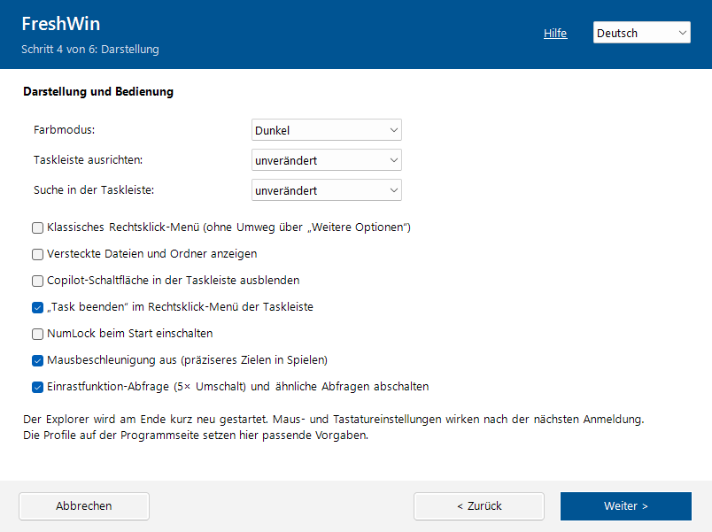

<div align="center">

# FreshWin

**Einen frisch installierten Windows‑11‑PC in einem Rutsch einrichten – Programme, Aufräumen, Darstellung und Updates in einem einfachen Assistenten.**

[](https://github.com/Floki89/FreshWin/releases/latest)
[](https://github.com/Floki89/FreshWin/releases)
[](LICENSE)


[English](README.md) | **Deutsch**



</div>

## Inhalt

- [Schnellstart](#schnellstart)
- [Funktionen](#funktionen)
- [Screenshots](#screenshots)
- [Benutzung](#benutzung)
- [Mehrere PCs einrichten](#mehrere-pcs-einrichten)
- [Voraussetzungen](#voraussetzungen)
- [Häufige Fragen](#häufige-fragen)
- [Anpassen](#anpassen)
- [Mitmachen](#mitmachen)
- [Haftungsausschluss](#haftungsausschluss)

## Schnellstart

Rechtsklick auf den Startknopf → **Terminal (Administrator)**, diese Zeile einfügen und Enter drücken:

```powershell
irm https://raw.githubusercontent.com/Floki89/FreshWin/main/FreshWin.bat | iex
```

Lieber eine Datei? **[FreshWin.bat herunterladen](https://github.com/Floki89/FreshWin/releases/latest/download/FreshWin.bat)**, doppelklicken und die Adminabfrage bestätigen.

> [!TIP]
> Erst einmal sehen, was passieren würde? Im **Testmodus** wird nichts verändert: `FreshWin.bat /test`

## Funktionen

**Programme**
- 77 Programme in 11 Kategorien, still installiert über [winget](https://learn.microsoft.com/de-de/windows/package-manager/winget/) – auch Apps aus dem Microsoft Store
- Profile **Gaming-PC** und **Büro-PC** haken passende Programme mit einem Klick an
- Suchfeld, Anzahl der ausgewählten Programme, bereits installierte Programme werden markiert
- Browser nach Wahl (Firefox, Chrome, Brave, Vivaldi oder Edge), auf Wunsch als Standardbrowser

**Windows aufräumen**
- Entfernt vorinstallierte Consumer-Apps (Xbox, Bing News, Solitaire, Clipchamp …) – Store, Fotos, Rechner und andere nützliche Apps bleiben
- Schaltet Werbung, Vorschläge, die Bing-Suche im Startmenü und Widgets ab, setzt die Telemetrie auf Minimum
- Zeigt Dateiendungen an, deaktiviert den Schnellstart
- Übernimmt die Einstellungen auch für künftige Benutzerprofile

**Darstellung**
- Dunkel- oder Hellmodus, Ausrichtung und Suchfeld der Taskleiste
- Klassisches Rechtsklick-Menü, versteckte Dateien anzeigen, Copilot-Schaltfläche ausblenden, „Task beenden“ in der Taskleiste
- NumLock beim Start, Mausbeschleunigung aus, keine Einrastfunktion-Abfrage

**Grundeinrichtung und Updates**
- Computer umbenennen, Zeiten für Bildschirm aus und Energiesparmodus
- Aktualisiert alle Programme (`winget upgrade --all`) und installiert Windows Updates, auf Wunsch mit Treibern
- Auf Wunsch automatischer Neustart am Ende – ideal, wenn das Setup über Nacht läuft

**Für frische PCs gemacht**
- Wiederherstellungspunkt vor allen Änderungen, Zusammenfassung vor dem Start
- Verhindert den Energiesparmodus, wartet nach der ersten Anmeldung auf winget, versucht es erneut, wenn
  Windows Update gerade installiert, überspringt hängende Installer
- Warnt bei fehlendem Internet, Akkubetrieb oder fremdem Adminkonto
- Kein Konsolenfenster, das man versehentlich schließen könnte; ausführliche Logdatei
- Deutsch und Englisch, automatisch erkannt und jederzeit umschaltbar

## Screenshots

| | |
|---|---|
|  |  |
|  |  |

## Benutzung

### Weg 1: ein Befehl, kein Download (empfohlen)

1. Rechtsklick auf den Startknopf → **Terminal (Administrator)**
2. Den Befehl aus dem [Schnellstart](#schnellstart) einfügen und Enter drücken
3. Das Terminal-Fenster offen lassen, solange FreshWin läuft

Kein Download und keine SmartScreen-Warnung. Die Logdatei landet auf dem Desktop.

### Weg 2: herunterladen

1. [FreshWin.bat herunterladen](https://github.com/Floki89/FreshWin/releases/latest/download/FreshWin.bat) (immer die neueste Version)
2. Doppelklicken und die Adminabfrage bestätigen
3. Dem Assistenten folgen

> [!NOTE]
> Edge und Windows SmartScreen können bei einer heruntergeladenen `.bat` warnen: In Edge *Behalten* wählen, dann
> *Weitere Informationen → Trotzdem ausführen*. FreshWin ist eine reine Textdatei – jede Zeile lässt sich vorher lesen.

### Weg 3: USB-Stick

`FreshWin.bat` auf einen USB-Stick kopieren und am neuen PC doppelklicken.

### Optionen

| Option | Wirkung |
|---|---|
| `/test` | Testmodus: zeigt, was passieren würde, ändert nichts, keine Adminrechte nötig |
| `/lang:de`, `/lang:en` | Sprache festlegen |
| `/config:datei.json` | Gespeicherte Auswahl laden |
| `/auto` | Sofort mit der gespeicherten Auswahl starten, ohne Klicks |

Auch eine Umbenennung in `FreshWin-TEST.bat` startet den Testmodus. Beim Ein-Zeilen-Befehl vorher
`$env:SETUP_ARGS = '/test'` ausführen.

## Mehrere PCs einrichten

1. Einmal die Auswahl treffen und auf der Zusammenfassung **Auswahl speichern …** klicken
2. Als `FreshWin.json` neben `FreshWin.bat` speichern (z. B. auf einem USB-Stick)
3. Auf jedem neuen PC lädt FreshWin sie automatisch – kurz prüfen und *Starten* klicken

Komplett ohne Klicks: `FreshWin.bat /auto` startet das Setup sofort. Zusammen mit
*Nach Abschluss automatisch neu starten* ist der PC am nächsten Morgen fertig.

## Voraussetzungen

- Windows 11 (das meiste funktioniert auch unter Windows 10)
- **Nicht im S-Modus** – dort laufen keine Skripte. Den S-Modus vorher unter *Einstellungen → System → Aktivierung* verlassen
- Administratorrechte (außer im Testmodus)
- Internetverbindung. Fehlt der WLAN-Treiber, hilft ein LAN-Kabel oder USB-Tethering mit dem Handy
- winget (*App-Installer*) ist bei Windows 11 vorinstalliert. Direkt nach der ersten Anmeldung wartet FreshWin, bis es
  bereit ist, und installiert bei Bedarf eine aktuelle Version

## Häufige Fragen

<details>
<summary><b>Was genau ändert FreshWin?</b></summary>

Nur das, was angehakt ist. Die Zusammenfassung zeigt vor dem Start alles an, und der Testmodus (`/test`) listet jeden
einzelnen Befehl und Registry-Wert auf, ohne etwas zu ändern. Alle Änderungen sind normale Windows-Einstellungen.
</details>

<details>
<summary><b>Wie mache ich die Änderungen rückgängig?</b></summary>

FreshWin legt vor allen Änderungen einen Wiederherstellungspunkt an (*Systemsteuerung → Wiederherstellung →
Systemwiederherstellung öffnen*). Einstellungen lassen sich außerdem jederzeit in den Windows-Einstellungen
zurückstellen, Programme wie gewohnt deinstallieren.
</details>

<details>
<summary><b>Ein Programm wurde nicht installiert – warum?</b></summary>

Die Logdatei (Knopf **Log öffnen** am Ende) nennt den Grund. Häufig: Der Installer hing und wurde nach 20 Minuten
abgebrochen, das Programm verweigert Adminrechte, oder Windows braucht erst einen Neustart. Diese Programme von Hand
installieren oder FreshWin nach dem Neustart erneut starten – bereits installierte Programme werden übersprungen.
</details>

<details>
<summary><b>Warum ist mein Browser noch nicht der Standardbrowser?</b></summary>

Windows 11 lässt kein Programm den Standardbrowser still setzen. Am Ende öffnet FreshWin
*Einstellungen → Standard-Apps* – dort einfach den Browser auswählen.
</details>

<details>
<summary><b>Wo liegt die Logdatei?</b></summary>

Neben `FreshWin.bat`, beim Start per Ein-Zeilen-Befehl auf dem Desktop (`FreshWin_<PC-Name>_<Datum>.log`).
</details>

<details>
<summary><b>Kann ich FreshWin später noch einmal ausführen?</b></summary>

Ja. Installierte Programme werden übersprungen, Einstellungen einfach erneut gesetzt. Ein zweiter Lauf nach dem
ersten Neustart ist ideal, um die restlichen Windows Updates mitzunehmen.
</details>

## Anpassen

Alles wird oben im PowerShell-Teil von `FreshWin.bat` eingestellt:

| Variable | Inhalt |
|---|---|
| `$Browsers` | Browser auf der ersten Seite |
| `$AppCatalog` | Programme nach Kategorie. `Id` ist die winget-ID (`winget search <Name>`), `Source = 'msstore'` für Store-Apps, `Def = $true` hakt es vor, `De`/`En` sind die Kurzbeschreibungen |
| `$Profiles` | Die Profile: winget-IDs und Vorgaben für die Darstellung |
| `$AppxRemove` | Vorinstallierte Apps, die entfernt werden |
| `$Strings` | Alle Texte auf Deutsch und Englisch |

## Mitmachen

Fehlt ein Programm oder ist etwas kaputt? [Issue anlegen](https://github.com/Floki89/FreshWin/issues/new/choose) –
für beides gibt es Vorlagen. Pull Requests sind willkommen; Änderungen bitte vorher im Testmodus prüfen.
Was sich zwischen den Versionen geändert hat, steht im [Changelog](CHANGELOG.md).

## Haftungsausschluss

> [!CAUTION]
> **Benutzung auf eigene Verantwortung.** FreshWin ändert Systemeinstellungen und entfernt Apps.
> **Zuerst im Testmodus ausprobieren** (`FreshWin.bat /test`) und vorzugsweise auf frisch installierten Rechnern einsetzen.

## Lizenz

[MIT](LICENSE) – gilt für FreshWin selbst. Die installierten Programme lädt winget direkt von den Herstellern,
für sie gelten deren eigene Lizenzen.
