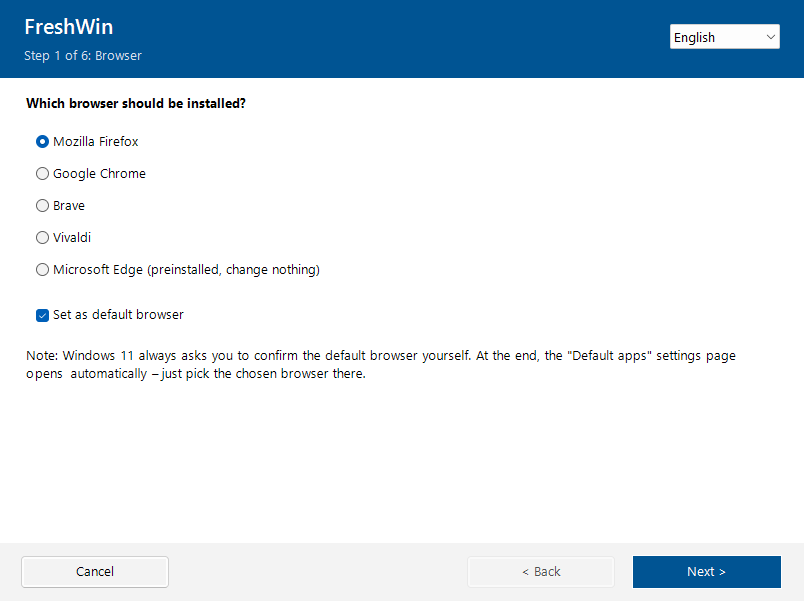
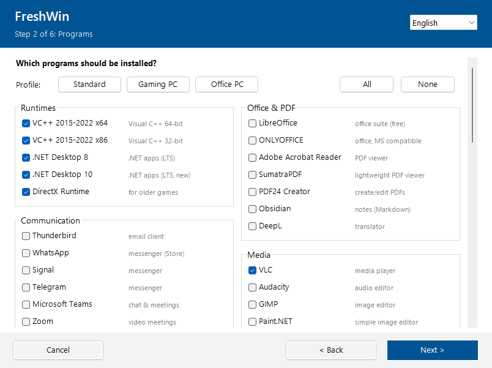
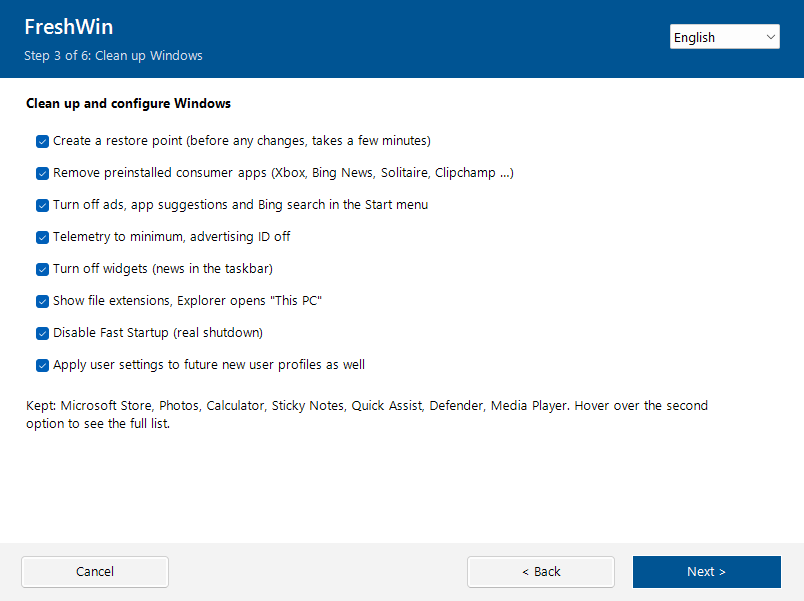
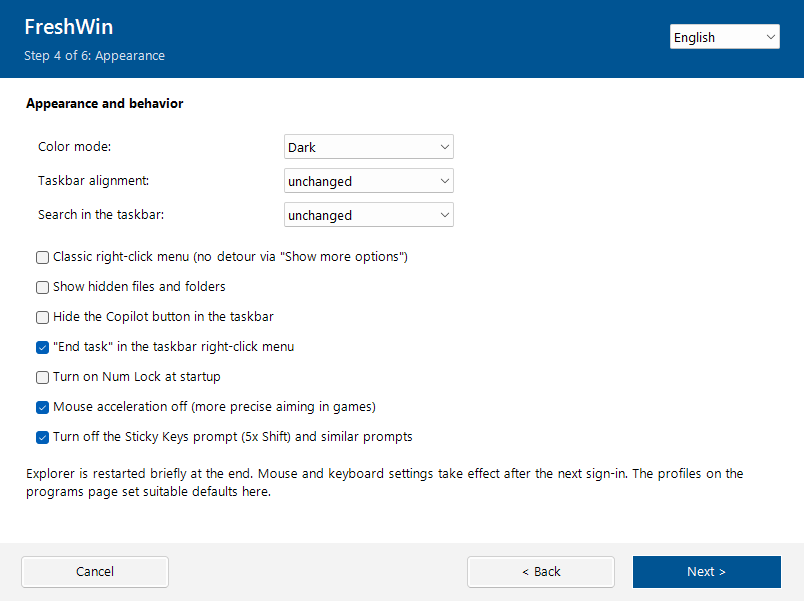

# FreshWin

**English** | [Deutsch](README.de.md)

A graphical setup wizard for fresh Windows 11 installations, in a single `.bat` file.
Pick a browser and your programs, clean up Windows, set the computer name and power
options, install all updates, and you're done. No installation, no dependencies.

| | |
|---|---|
|  |  |
|  |  |

## Features

- **Browser**: Firefox, Chrome, Brave, Vivaldi or keep Edge, optionally as the default browser
- **77 programs** in 11 categories, installed silently via [winget](https://learn.microsoft.com/windows/package-manager/winget/)
  (runtimes, office & PDF, communication, media, utilities, security & VPN, system & remote help,
  development, cloud storage, gaming launchers, gaming voice & tools). Programs that are already installed are skipped
- **Gaming**: Steam, Epic, Ubisoft Connect, EA app, Battle.net, GOG, Rockstar, Amazon Games, Xbox app,
  Discord, TeamSpeak, Mumble, NVIDIA App, MSI Afterburner, peripheral software and more.
  Selecting the Xbox app keeps the Xbox components when Windows is cleaned up
- **Profiles**: *Gaming PC* and *Office PC* check suitable programs with one click and preset
  the appearance page (the NVIDIA App is only added if an NVIDIA graphics card is present)
- **Appearance**: dark/light mode, taskbar alignment and search, classic right-click menu,
  show hidden files, hide Copilot button, "End task" in the taskbar, Num Lock at startup,
  mouse acceleration off, Sticky Keys prompt off
- **Clean up Windows**: removes preinstalled consumer apps (Xbox, Bing News, Solitaire, Clipchamp …),
  turns off ads, suggestions, Bing search in Start and widgets, sets telemetry to minimum,
  shows file extensions, disables Fast Startup
- **New user profiles** get the same settings (via the default profile)
- **Basic setup**: rename the computer, display/sleep timeouts for AC and battery
- **Updates**: `winget upgrade --all` and Windows Update (without drivers)
- **Safety net**: creates a restore point before any change, and a summary page shows everything before it starts
- **Log file** next to the script (or in `%TEMP%`)
- **German and English**, detected automatically and switchable in the window
- **Test mode**: shows exactly what *would* happen and changes nothing

## Usage

1. Download [`FreshWin.bat`](FreshWin.bat) (on GitHub: *Raw* → save, or download the repository as ZIP).
2. Double-click it and confirm the administrator prompt.
3. Follow the wizard.

> Windows SmartScreen may warn about a downloaded `.bat` file. Choose *More info → Run anyway*,
> or right-click the file → *Properties* → *Unblock*. Read the script first if you're unsure:
> it's plain text.

### Options

| Call | Effect |
|---|---|
| `FreshWin.bat /test` | Test mode, no admin rights needed and nothing is changed |
| `FreshWin.bat /lang:en` / `/lang:de` | Force the language |
| rename to `FreshWin-TEST.bat` | Test mode by double-click |

## Requirements

- Windows 11 (most things also work on Windows 10)
- Administrator rights (except in test mode)
- Internet connection
- winget (*App Installer*). It's preinstalled on current Windows 11. On a very fresh install,
  update *App Installer* in the Microsoft Store first if FreshWin reports it as missing

## Customizing

All lists are at the top of the PowerShell part of `FreshWin.bat`:

- `$Browsers` lists the browsers
- `$AppCatalog` lists programs by category. `Id` is the winget ID (find one with `winget search <name>`;
  `Source = 'msstore'` for Microsoft Store apps),
  `Def = $true` pre-checks the program, `De`/`En` hold the short descriptions
- `$Profiles` defines the profiles (winget IDs plus appearance defaults)
- `$AppxRemove` lists the preinstalled apps that get removed
- `$Strings` holds all texts (German and English)

## Notes

- Windows 11 doesn't let scripts set the default browser for the current user. FreshWin
  registers it for new profiles where possible and opens *Settings → Default apps* at the end.
- Telemetry level 1 ("required") is the minimum on Windows Home/Pro.
- Everything FreshWin changes is a normal Windows setting and can be reverted in Settings, or with the restore point.

## Disclaimer

Use at your own risk. FreshWin changes system settings and removes apps. Run it in
test mode first and preferably on freshly installed machines.

## License

[MIT](LICENSE)
